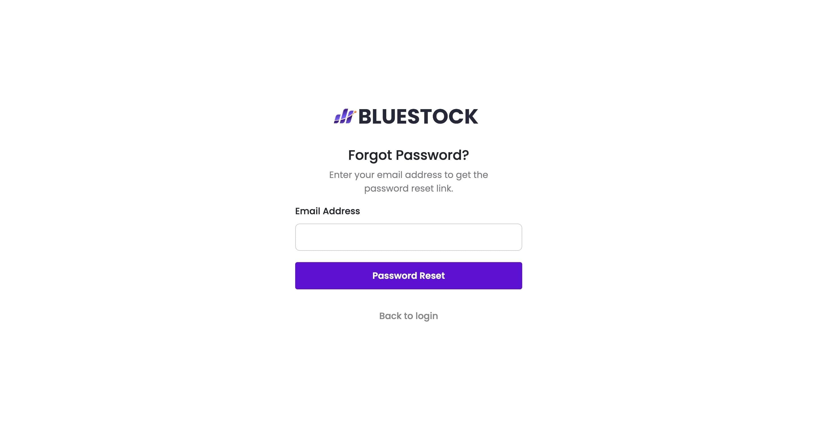

## IPO Management System

The **BlueStock IPO Management System** is designed for listing IPOs with full CRUD (Create, Read, Update, Delete) operations.

The project is divided into two applications that need to be run individually on different servers:

```bash
TEAM_12@bluestock-Fintech\backend  # Backend application directory
TEAM_12@bluestock-Fintech\client   # Client application directory
```

---

To include instructions on how to clone the project in your documentation, you can add a section like this:

---

## Clone This Project

To get a copy of this project up and running on your local machine, follow these steps:

## Clone the Repository

```bash
git clone https://github.com/bitz-1/TEAM12-bluestock-Fintech.git
```
## Installation

### Step 1: Create Virtual Environments

First, create virtual environments for both the backend and client in their respective directories:

```bash
# For Backend
cd TEAM_12-bluestock-Fintech\backend
python -m venv v-backend

# For Client
cd TEAM_12-bluestock-Fintech\client
python -m venv v-client
```

### Step 2: Activate the Virtual Environments

Next, activate the virtual environments in separate terminal windows:

**For Backend:**

```bash
cd TEAM_12-bluestock-Fintech\backend\v-backend\Scripts
.\activate
```

**For Client:**

```bash
cd TEAM_12-bluestock-Fintech\client\v-client\Scripts
.\activate
```

### Step 3: Install Dependencies in the Backend Environment

Once the backend virtual environment (`v-backend`) is activated, install the backend dependencies:

```bash
cd TEAM_12-bluestock-Fintech\backend\bluestock-ipo-rest-api-master 2\
pip install -r requirements.txt
```

### Step 4: Set Up Your `.env` File

Create a `.env` file in the backend directory and add the following configurations:

```bash
EMAIL_USER='your_email_user'
EMAIL_PASS='your_password'
EMAIL_FROM='your_email'

PGHOST='ep-long-mountain-a1fk23sc.ap-southeast-1.aws.neon.tech'
PGDATABASE='bluestockdb'
PGUSER='bluestockdb_owner'
PGPASSWORD='2dFsB1rbWCEn'
```

You can adjust the database settings as needed.

### Step 5: Run Database Migrations

Run the database migrations to set up the database schema:

```bash
python manage.py migrate
```

### Step 6: Create a Superuser

Create a superuser for managing the application:

```bash
python manage.py createsuperuser
```

### Step 7: Start the Development Server

Start the backend development server on port `8001`:

```bash
python manage.py runserver 8001
```

### Access the Admin Interface

Open your web browser and go to `http://127.0.0.1:8001/admin`. Log in using the superuser credentials to manage users and admins.

### API Documentation

For more details, visit the [API Documentation](https://github.com/bitz-1/bluestock-ipo-rest-api).

### Step 8: Install Dependencies in the Client Environment

Once the client virtual environment (`v-client`) is activated, install the client dependencies:

```bash
cd TEAM_12-bluestock-Fintech\client\client\Team12 db exp 2\
pip install -r requirements.txt
```

### Step 9: Run Database Migrations for the Client

Run the database migrations for the client application:

```bash
python manage.py migrate
```

### Step 10: Start the Client Server

Start the client development server on port `8000`:

```bash
python manage.py runserver 8000
```

---

## Usage

For detailed instructions on using the client side, watch the [YouTube Video](https://youtu.be/U9MjdQDL-a4).

For detailed instructions on the REST API, watch the [Loom Video](https://www.loom.com/share/09b3cf9912a5479481f7aff38fcdfb6b).

---

## Contribution

### TEAM12
- **Apurv Nandgaonkar** - [email](mailto:apurv.mod@gmail.com)(Backend SDE)
- **Anshu Dwivedi** - [email](mailto:anshudwivedi135@gmail.com) (Frontend SDE)
- **Chetan Pal** - [email](mailto:chetanpal98@outlook.com) (Frontend SDE)
- **Kaustubh Bhatt** - [email](mailto:kaustubhbhatt18@gmail.com) (Frontend SDE)

---

## License

This project is licensed under the Bluestock Fintech License. For more details, visit [Bluestock Fintech](https://bluestock.in/).

---
## Screenshots 
### Admin Dashboard

### Ipo Manage 


### login 


### Register


### Forgot Password




### IPO Listing


### Home


